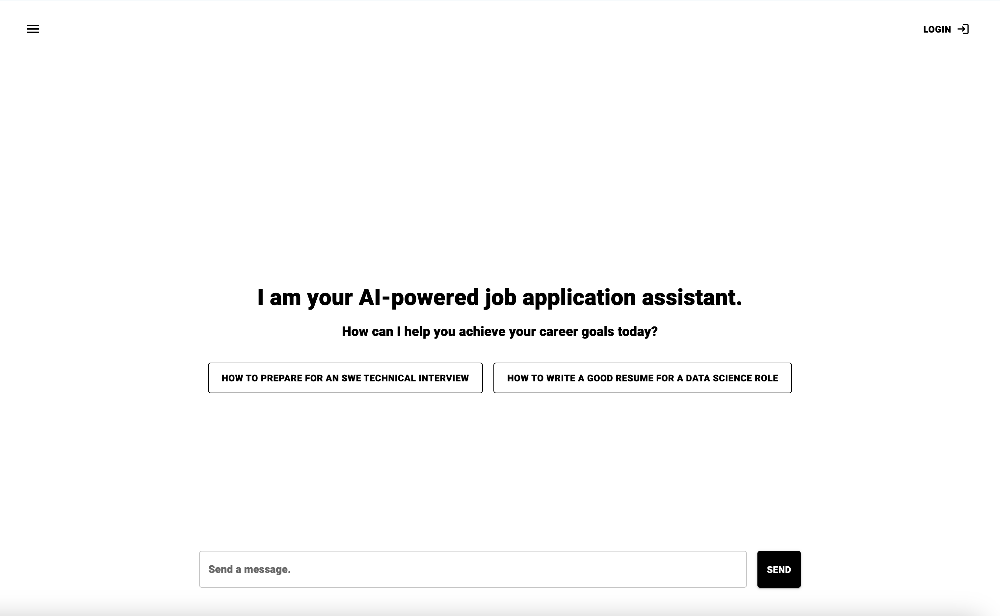

# AI Customer Support

This project is an AI-powered customer support application built using Next.js, JavaScript, Material UI, Vercel, Kinde, Supabase, and the Gemini API. 

## About

The app was built during our fellowship to learn how to develop products that improve customer interactions on any business site by providing intelligent, responsive support, thereby helping businesses maintain a high Net Promoter Score (NPS) through effective customer service.

## Preview

    

https://github.com/user-attachments/assets/43719ba0-d305-4347-9b9a-75e148227beb

## Usage

You can visit the deployed site at [AI Customer Support](https://ai-customer-support-tau.vercel.app/) and start a conversation with the AI to see how it responds to customer queries for a job application tracking site.

